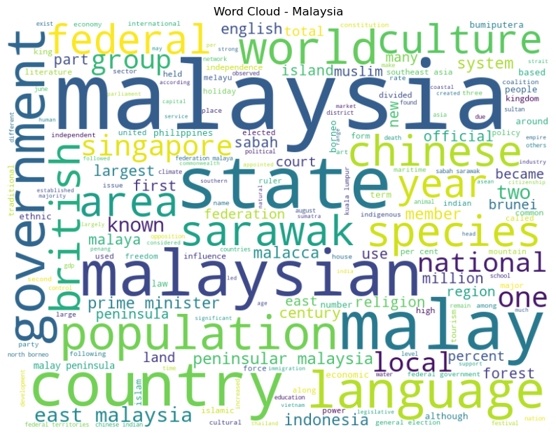
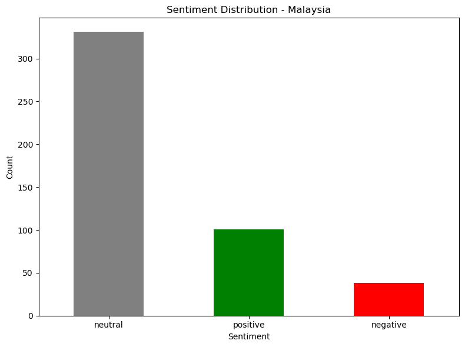
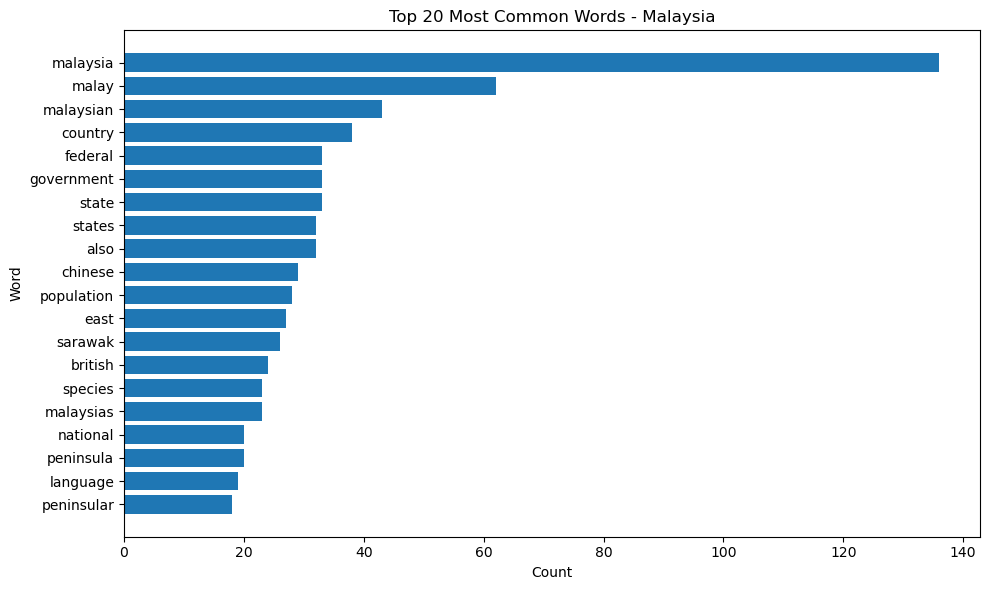
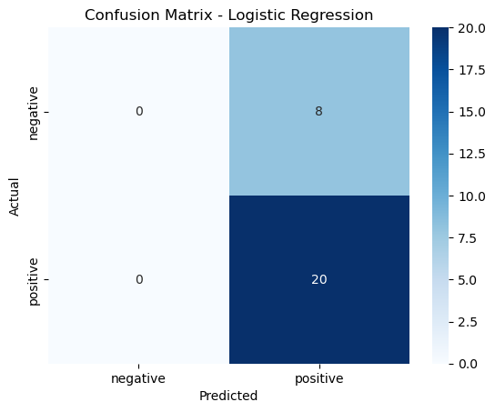
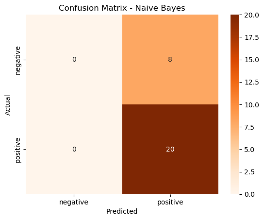
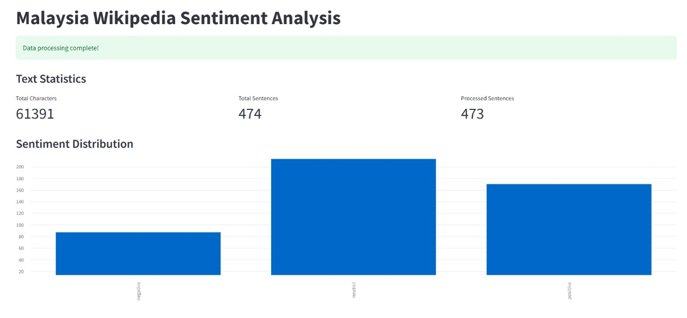
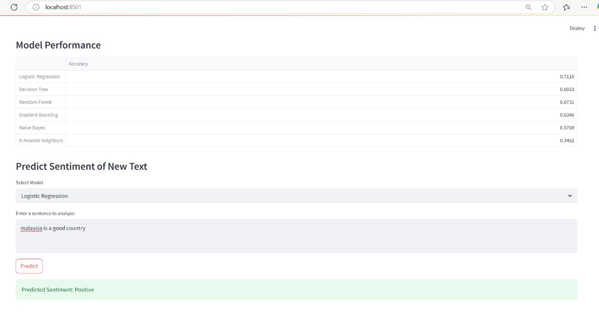

# 📊 Sentiment Analysis of Malaysia's Wikipedia Page  

  

## 🌟 Project Overview  
This project performs **sentiment analysis** on Malaysia's Wikipedia page using NLP and machine learning. It reveals how Malaysia is portrayed in digital encyclopedic content, with insights into:  
- 🎭 **Sentiment trends** (Positive/Negative/Neutral)  
- 🏛️ **Key themes** like governance, culture, and geography  
- 🤖 **Model performance** (Logistic Regression vs. Naive Bayes)  

---

## 🔍 Key Findings  

### 1. Sentiment Distribution  
  
- **70.4% Neutral** (Wikipedia's objective tone)  
- **21.5% Positive** vs. **8.1% Negative**  

### 2. Most Frequent Topics  
  
  
Top terms:  
- **Governance**: `government`, `federal`, `state`  
- **Culture**: `Malay`, `Chinese`, `Malaysian`  
- **Geography**: `peninsula`, `Sarawak`  

### 3. Model Performance  
| Model               | Accuracy | F1-Score (Positive) | Confusion Matrix |  
|---------------------|----------|---------------------|------------------|  
| Logistic Regression | 71%      | 0.83                |  |  
| Naive Bayes         | 71%      | 0.83                |  |  

*Both models struggled with negative sentiment due to class imbalance.*  

---

## 🛠️ Files Included  

### 📂 Code & Data  
| File                     | Description                          |  
|--------------------------|--------------------------------------|  
| `sentiment_analysis.py`   | Python script for analysis           |  
| `malaysia.ipynb`         | Jupyter Notebook (detailed steps)   |  
| `Malaysia_project_report.pdf` | Full report (methodology + insights) |  

### 📊 All Visualizations  
| Image                     | Description                          |  
|---------------------------|--------------------------------------|  
|  | Text preprocessing metrics |  
|  | Live sentiment prediction example |  

---

## 🚀 How to Use  
1. **Clone the repo**:  
   ```bash
   git clone https://github.com/yourusername/sentiment-analysis-malaysia.git
